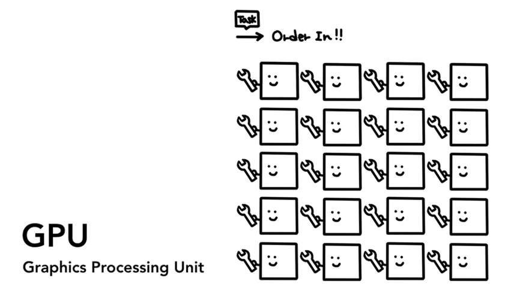

> 原文地址：[Inside look at modern web browser (part 1)](https://developers.google.com/web/updates/2018/09/inside-browser-part1)

## CPU，GPU，内存和多进程架构

在这个由 4 部分组成的博客系列中，我们将介绍 Chrome 浏览器内部的高级架构以及渲染流程的细节。
如果你想知道浏览器如何将你的代码转换为具有功能的网站，或者不确定为什么建议使用特定技术来提高性能，那么本系列适合你。

作为本系列的第 1 部分，我们将介绍核心计算术语和 Chrome 的多进程架构。

> 注意：如果你熟悉 CPU / GPU 和进程/线程的概念，可以直接跳到 [浏览器架构体系](#浏览器架构体系)。

## 计算机的核心： CPU 和 GPU

为了理解浏览器运行的环境，我们需要了解一些计算机部件及其功能。

### CPU

首先是 CPU - 中央处理器，可以看作是计算机的大脑。
一个 CPU 内核就如下图中的一个工作人员，可以逐个处理许多不同的任务。它可以处理从数学到艺术的所有事情，同时也知道如何响应客户的需求。
过去的 CPU 大多都是单芯片的。
一个内核就像存在于同一芯片中的另一个 CPU。
在现代硬件中，CPU 通常有多个内核，从而为你的手机和笔记本电脑提供更强大的计算能力。

**图 1：4 个 CPU 核心作为工作人员，坐在办公桌处理各自的任务**

### GPU

GPU - 图形处理单元，是计算机的另一部分。
与 CPU 不同，GPU 擅长处理跨内核的简单任务。
顾名思义，它最初是为处理图形而开发的。
这就是为什么在图形环境中“使用 GPU”或“GPU 支持”与快速渲染和平滑交互相关联。
近年来，随着 GPU 加速计算的发展，仅在 GPU 上就可以实现越来越多的计算。

**图 2：许多带有扳手的 GPU 内核意味着它们可以处理有限的任务**

当你在计算机或手机上启动应用程序时，应用程序就会通过操作系统提供的机制在 CPU 和 GPU 上运行。

**图 3：三层计算机体系结构。机器硬件位于底部，操作系统位于中间，应用程序位于顶部。**

## 在 Process 和 Thread 上执行程序

在深入浏览器架构之前要掌握的另一个概念是 Process（进程） 和 Thread（线程）。
进程可以理解为执行应用的程序。
线程存在于进程内部，并执行程序的任意部分。

**图 4：进程作为一个边界，线程包含在其内部，像一个抽象鱼一样，在进程内游动**

启动应用程序时，将创建一个进程。
该进程可能会创建线程来帮助它工作，但这是可选的。
操作系统为进程提供了一块“slab”内存，并且所有应用程序状态都保存在该专用内存空间中。
关闭应用程序时，该过程也会消失，操作系统会释放内存。

**图 5：使用内存空间和存储应用程序数据的进程图**

进程可以请求操作系统启动另一个进程来运行不同的任务。
此时，操作系统将会为新进程分配内存中不同的一部分。
如果两个进程需要通信，他们可以通过使用进程间通信（IPC）来实现。
许多应用程序都设计为以这种方式工作，以便在工作进程无响应时，可以重新启动它，而无需停止运行应用程序的其他进程。

**图 6：通过 IPC 进行通信的独立进程图**

## 浏览器架构体系

那么如何通过使用进程和线程来构建 Web 浏览器呢？
它可以由一个拥有多个线程的进程来构建，也可以由多个通过 IPC 通信的不同进程来构建。

**图 7：多个进程浏览器体系结构，或包含多个线程的进程浏览器体系结构**

这里需要注意的重要一点是，这些不同的架构是具体的实现细节。
关于如何构建 Web 浏览器，并没有一个标准的规范。
各个浏览器的实现方式可能完全不同。

本博客系列中，我们将使用下图所示的 Chrome 架构进行阐述。

Chrome 架构中最重要的是浏览器进程，他负责运行应用程序其他部分进程之间的协调工作。
对于渲染器进程，他将会创建多个进程并将其分配给每个标签页。
直到近期，Chrome 在可能情况下会为每个标签页提供了一个进程;
现在它尝试为每个站点分配一个独立的进程，包括 iframe。

**图 8：Chrome 的多进程架构图。渲染进程下显示多个图层，表示 Chrome 为每个选项卡运行多个渲染器进程。**

## 不同的进程都控制着什么?

下表介绍了每个 Chrome 流程及其控制的内容：

| 进程     | 控制                                                                                                                            |
| -------- | ------------------------------------------------------------------------------------------------------------------------------- |
| Browser  | 控制应用程序的“chrome”部分，包括地址栏，书签，后退和前进按钮。  还处理 Web 浏览器的不可见特权部分，例如网络请求和文件访问。 |
| Renderer | 控制显示标签页内的任何内容。                                                                                                    |
| Plugin   | 控制网站使用的任何插件，例如 flash。                                                                                            |
| GPU      | 处理独立于其它进程的 GPU 任务。GPU 被分成不同进程，因为 GPU 处理来自多个不同应用的请求并绘制在相同表面。                        |

**图 9：浏览器进程示意图**

还有更多的进程，如扩展进程和应用进程。
如果你想查看 Chrome 中正在运行的进程，可以点击右上角的选项菜单图标，选择更多工具，然后选择任务管理器。然后会打开一个窗口，其中列出了当前正在运行的进程以及它们当前的 CPU/内存使用量。

## Chrome 多进程架构的优点

前文中提到 Chrome 使用多个渲染器进程。
在最简单的情况下，你可以想象每个标签页都有自己的渲染器进程。
假设你打开了 3 个标签页，每个标签页都由独立的渲染器进程运行。
如果一个标签页无响应，那么可以关闭无响应的这个标签页，同时不会影响到其他标签页的运行。
如果所有选项卡都在一个进程上运行，则当一个选项卡无响应时，所有选项卡都无响应。
这样体验会很糟糕。

**图 10：独立渲染器进程和同一渲染器进程的区别示意图**

将浏览器的工作分成多个进程的另一个好处是安全性和沙箱化。
由于操作系统提供了限制进程权限的方法，因此浏览器可以从某些功能中对某些进程进行沙箱处理。
例如，Chrome 浏览器可以限制处理任意用户输入（如渲染器进程）的进程的任意文件访问。

由于进程有自己的私有内存空间，因此它们通常包含公共基础设施的副本（例如 V8，它是 Chrome 的 JavaScript 引擎）。
这意味着更多的内存使用，因为如果它们是同一进程内的线程，它们将无法以它们的方式共享。
为了节省内存，Chrome 限制了它可以启动的进程数量。
具体的限制因设备的内存和 CPU 功率而异，但当 Chrome 达到限制时，会开始在同一站点的不同标签页上运行同一进程。

## 节省更多内存 - Chrome 中的服务化

同样的方法也适用于浏览器进程。
Chrome 正在进行体系结构的变革，以便将浏览器程序的每个部分作为一项服务运行，从而可以轻松地拆分或聚合不同的进程。

流行的观点是，当 Chrome 在性能比较好的硬件上运行时，它可能会将每个服务拆分为不同的进程，从而提供更高的稳定性，但如果它位于性能比价差的设备上时，Chrome 会将服务整合到一个进程中，从而节省内存占用。
在此改革之前，在类似 Android 的平台上已经使用了类似的方法来整合进程以减少内存使用。

**图 11：Chrome 将单个浏览器进程结构更改为多个浏览器进程结构**

## iframe 渲染进程 - 站点隔离

站点隔离是 Chrome 中最近推出的一项功能，可为每个跨网站 iframe 运行单独的渲染器进程。
我们一直在谈论标签页的渲染器进程，它允许跨站点 iframe 在单个渲染器进程中运行，并在不同站点之间共享内存空间。
在同一个渲染器进程中运行 a.com 和 b.com 似乎没问题。
同源策略是 Web 的核心安全模型; 它确保一个站点在未经同意的情况下无法访问其他站点的数据。
绕过此策略是安全攻击的主要目标。
使用进程是站点隔离最有效的方法。
随着 Meltdown 和 Spectre 的出现，使用进程隔离站点更加势在必行。
Chrome 67 版本以后，就已经在默认情况下启用了站点隔离，会为标签页中的跨站点 iframe 分配单独的渲染器进程。

**图 12：站点隔离，多个渲染器进程指向站点内的 iframe**

启用站点隔离是一项经历了多年的工程工作。
站点隔离并不只是分配不同的渲染器进程这么简单;
它从根本上改变了 iframe 的通信方式。
在运行不同 iframe 进程的页面上上打开开发者工具，必须做一些幕后工作才能使开发者工具其看起来正常。
即使运行简单的 Ctrl + F 来查找页面中的单词，也意味着在不同的渲染器进程中进行搜索。
这也是为什么浏览器工程师将发布站点隔离作为一个重要里程碑！

## 总结

在这篇文章中，我们从高级视角介绍了浏览器架构体系，并介绍了多进程架构体系的优点。
我们还介绍了 Chrome 中与多进程架构密切相关的服务化和站点隔离。
在下一篇文章中，我们将开始深入研究这些进程和线程之间发生的事情，使得可以呈现出一个功能性的网站。
